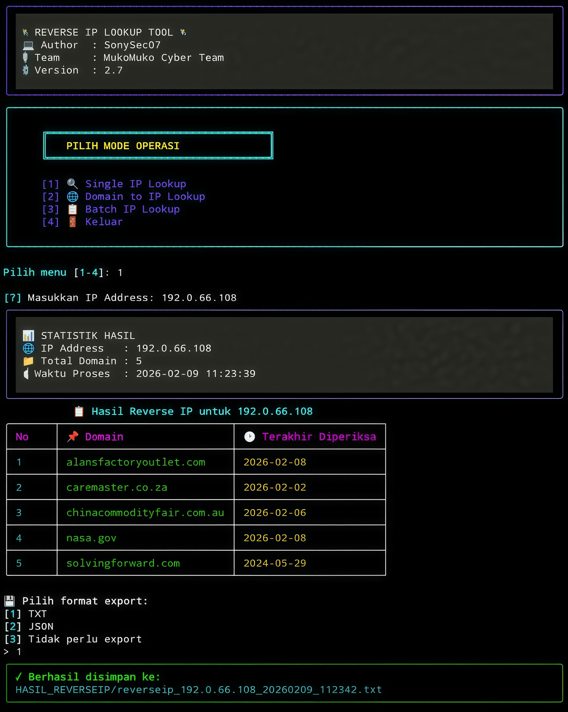

## Apa Itu Reverse IP
- Reverse IP adalah teknik untuk mencari tahu daftar semua situs web (domain) yang berbagi satu alamat IP yang sama.

## FITUR
- Reverse IP Single Lookup - Cari semua domain di satu server/IP
- Domain to IP Lookup - Konversi domain ke IP lalu lakukan reverse IP
- Batch IP Processing - Proses multiple IP sekaligus
- Multiple Format - Export ke TXT dan JSON
- Auto-filename - Nama file dengan timestamp

## Instalasi Dengan Kali Linux
```
$ sudo apt update && sudo apt upgrade -y
$ sudo apt install python3
$ sudo apt install git
$ git clone https://github.com/JohnFelixx/reverse_ip
$ cd reverse_ip
$ pip install -r requirements.txt
$ python3 reverseip.py
```
## Instalasi Dengan Termux
```
$ pkg update && pkg upgrade -y
$ pkg install python3
$ pkg install git
$ git clone https://github.com/JohnFelixx/reverse_ip
$ cd reverse_ip
$ python3 -m pip install -r requirements.txt
$ python3 reverseip.py
```

## Tangkapan Layar


## Hubungi Kami
- [Instagram JohnFelix](https://instagram.com/johnfelix_777)
- [Instagram Team](https://instagram.com/mukomuko_cyber_team)
- [Telegram](https://t.me/OrdinaryPeople403)

## SUPPORT ME
- [Saweria](https://saweria.co/SonySec07)

Copyright © 2023 MUKOMUKO CYBER TEAM
